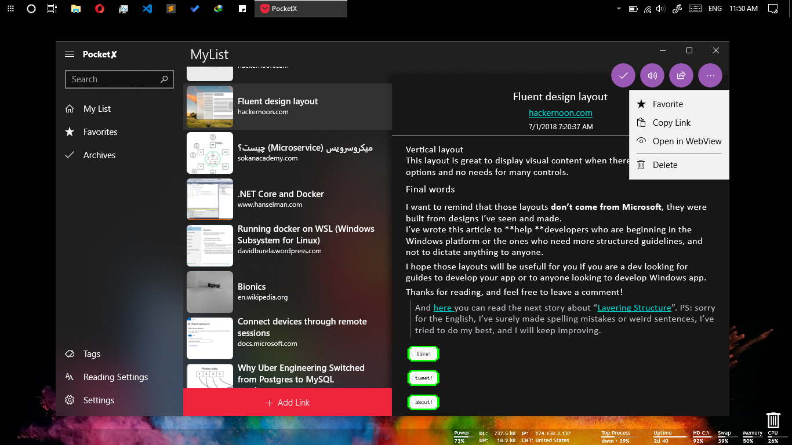

# Pocket✘

Unoffical Pocket Client for Windows (Modern with Fluent Design)

[❄ Other Apps ❄](https://yazdipour.github.io/apps)

[🌐 Website](https://yazdipour.github.io/)

<!--  -->

## Features:
* Read Articles (Even Offline)
* Save Links
* Manage your Favorites and Archive List
* Custom Theme
* Text to Speech

##  Thanks to:
* Appcenter
* https://github.com/Microsoft/WindowsCommunityToolkit
* https://github.com/reactiveui/Akavache
* https://github.com/ceee/PocketSharp/
* https://github.com/ceee/ReadSharp
* https://www.nuget.org/packages/HtmlAgilityPack/
* https://www.nuget.org/packages/BFound.HtmlToMarkdown/
* https://github.com/deanchalk/UWPChipsControl
* https://github.com/colinkiama/UWP-Circle-Button-Style-
* Icon: https://www.flaticon.com/free-icon/pocket-sketched-social-symbol_39338#term=pocket&page=1&position=36

## Donate

* 

* 

* 

