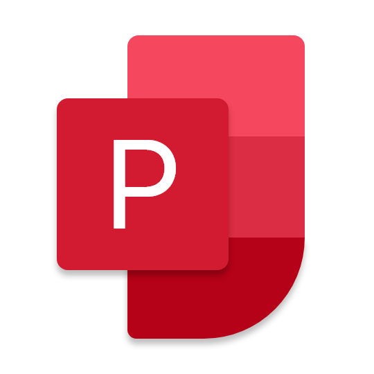
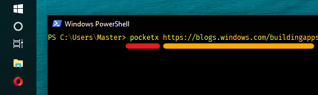

# Pocket✘



Unofficial Pocket Client for Universal Windows Platform (Modern with Fluent Design)

### Install

[](https://www.microsoft.com/store/apps/9NDT5N34SR2P?ocid=badge)

### Donate

[](https://yazdipour.github.io/donate/)

## Features

* Read Articles (Even Offline)
* Save Links
* Manage your Favorites and Archive List
* Custom Theme
* Text to Speech


* Add URL to Pocket using Terminal



## Development setup

Fill these properties in `PocketX/Handlers/Keys.cs` file with your tokens.

```CS
internal static readonly string Pocket = "POCKET_TOKEN";
internal static readonly string AppCenter = "APPCENTER_TOKEN"; //OPTIONAL
```

Repo Structure:

```
-> Source
    -> PocketX          # Application It Self
    -> PocketX.UnitTest # Not Impl Yet 😓
    -> Logger           # Logging + Appcenter
    -> CacheManager     # LruCache + Akavache
```
