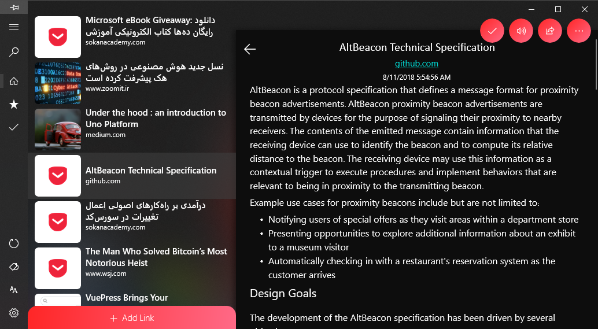

# Pocket✘

Unoffical Pocket Client for Windows (Modern with Fluent Design)

[❄ Other Apps ❄](https://yazdipour.github.io/apps)

[🌐 Website](https://yazdipour.github.io/)

<!--  -->

## Features:
* Read Articles (Even Offline)
* Save Links
* Manage your Favorites and Archive List
* Custom Theme
* Text to Speech

## Donate

* 

* 

* 